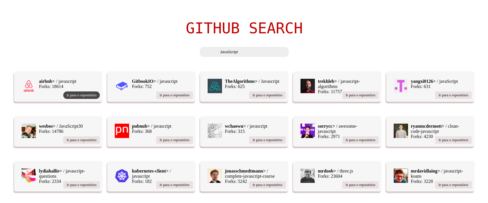

  

<h1 align="center"> 
    
    <strong>GitHub Search </strong> 
    
</h1>

	
	

## **Projeto**

	Através do texto informado no campo de pesquisa, é realizada uma busca nos repositórios do GitHub filtrando algumas informações dos repositórios que tiverem no nome o **texto informado**

## **Desenvolvimento**

	O projeto foi desenvolvido utilizando HTML5 + CSS3 + JavaScript

##### Autores dos ícones utilizados neste arquivo: 
* 

    Icons made by 
    <a href="https://www.flaticon.com/authors/pixel-perfect" title="Pixel perfect">Pixel perfect</a> 
    from 
    <a href="https://www.flaticon.com/" title="Flaticon">www.flaticon.com
    </a>
  

